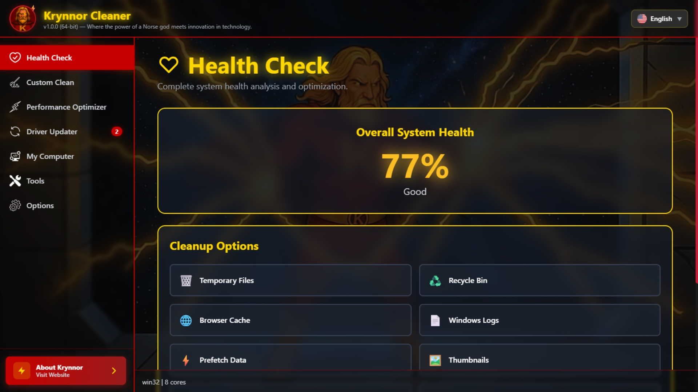
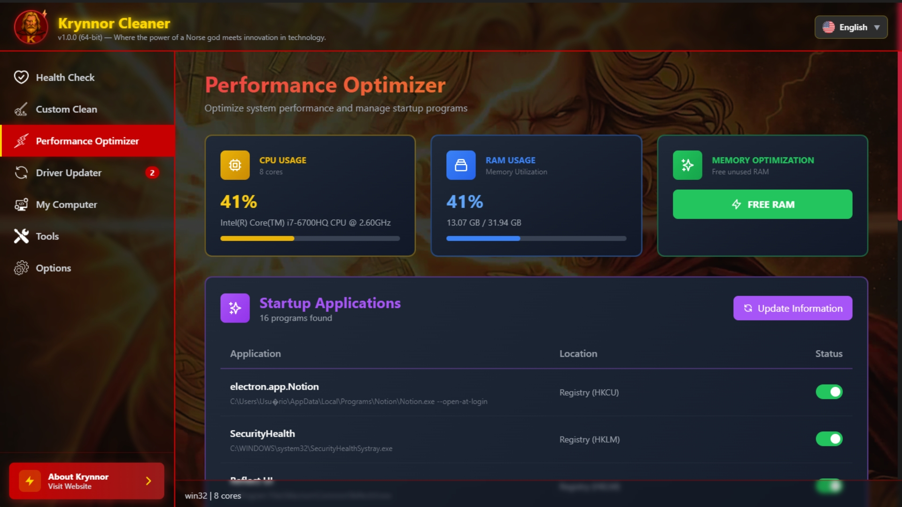
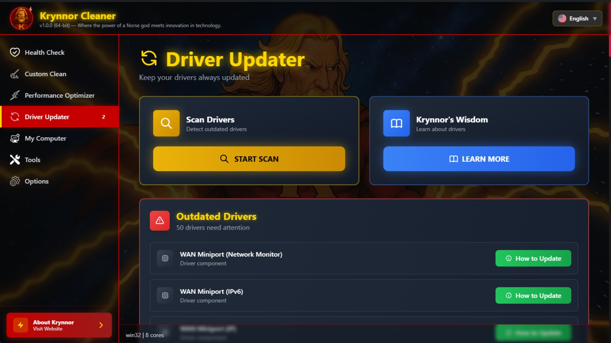
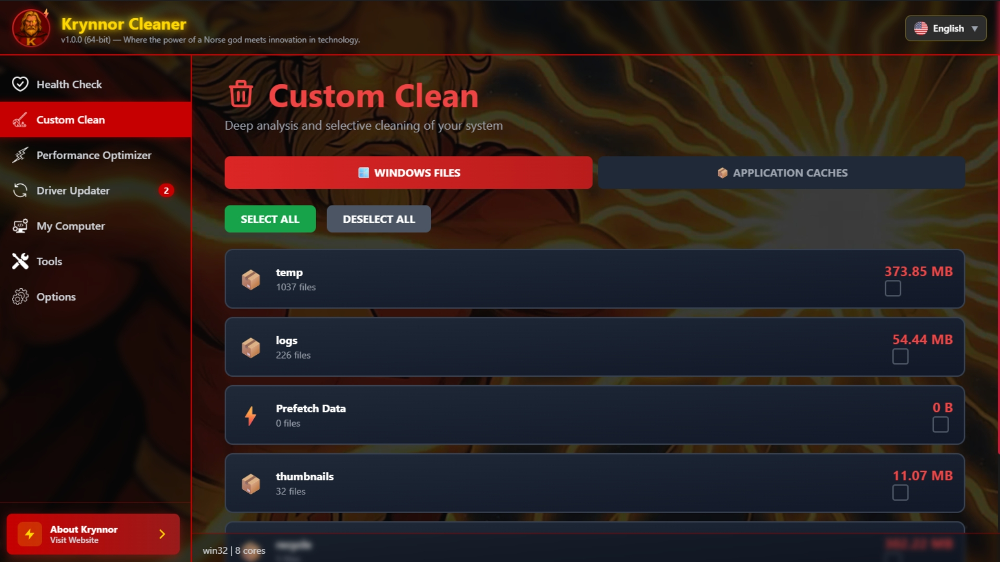
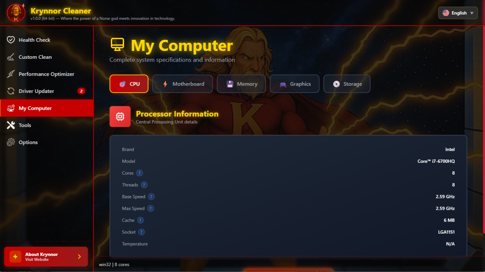

# Krynnor Cleaner  
**Version 1.0.0**

  

Krynnor Cleaner is an open-source desktop system assistant built with **Electron** and **React**, designed to provide system diagnostics, safe cleanup options, and hardware insights through a clean and well-structured interface.

This project represents **version 1.0.0**, marking the first stable public release focused on architecture clarity, security, and learning-oriented development.

---

## 🧭 Project Status

**Current Version:** `v1.0.0`  
**Status:** Stable (Initial Public Release)

Krynnor Cleaner is under continuous development.  
Future versions will focus on refactoring, performance improvements, and deeper architectural refinements as part of an ongoing learning and evolution process.

---

## 🖥️ Application Screenshots

Below are some screenshots showcasing the main modules of **Krynnor Cleaner**, highlighting its structure and functionality.

---

### ⚡ Performance Optimizer

Provides real-time insights into CPU and memory usage, helping users understand system performance behavior and identify resource-intensive processes.

---

### 🔄 Driver Updater

Scans installed drivers and identifies outdated components, offering clear information and guidance without performing unsafe automatic updates.

---

### 🧹 Custom Clean

Allows selective system cleanup, giving users control over what is analyzed and removed, prioritizing transparency and safety.

---

### ❤️ Health Check

Performs an overall diagnostic analysis of the system, acting as an initial assessment before any maintenance action.

---

### 🖥️ My Computer

Displays detailed hardware and system information, providing a clear overview of the machine’s specifications and environment.

---

## 🧰 Tech Stack

- Electron
- React
- Node.js
- Tailwind CSS
- JavaScript

---

## 🤖 AI Assistance Disclosure

Parts of this project were developed with the assistance of **Claude (Anthropic AI)**, used as a supporting tool for code generation, debugging, and architectural suggestions.

All learning, understanding, refinements, and final technical decisions were made manually as part of a professional and educational development process.

---

## 🎯 Project Goals

- Understand Electron architecture (main process, renderer, IPC)
- Practice secure system-level interactions
- Build a maintainable and modular desktop application
- Develop real-world software organization skills
- Serve as a foundation for future Krynnor-based projects

---

## ⚠️ Disclaimer

This application is intended for educational and experimental purposes.  
System-level operations are intentionally limited and designed with safety and transparency in mind.

---

## 📜 License

MIT License
